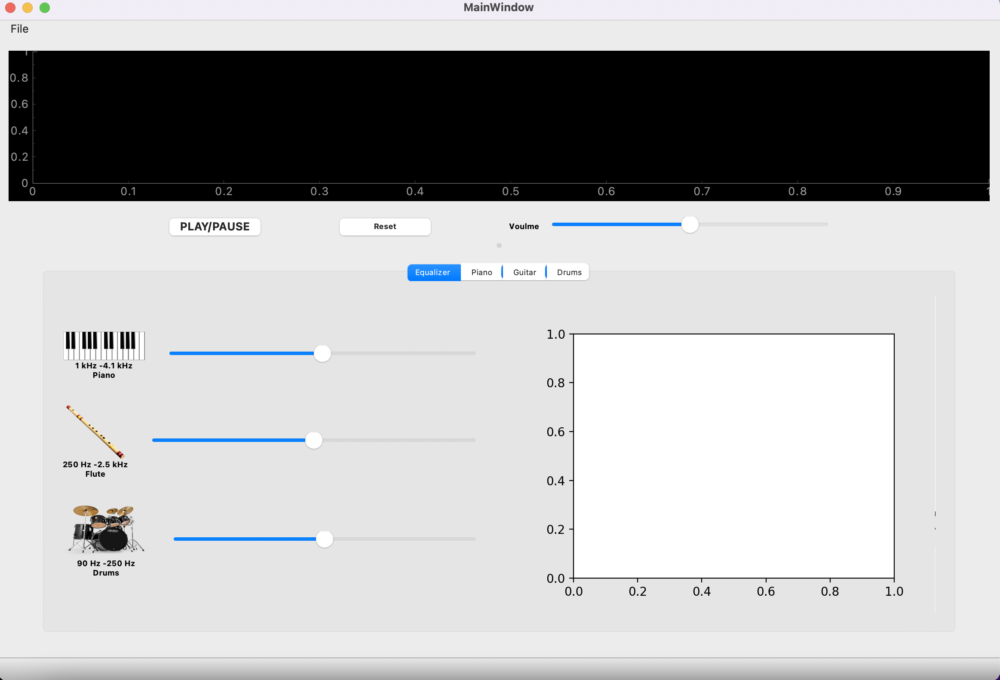
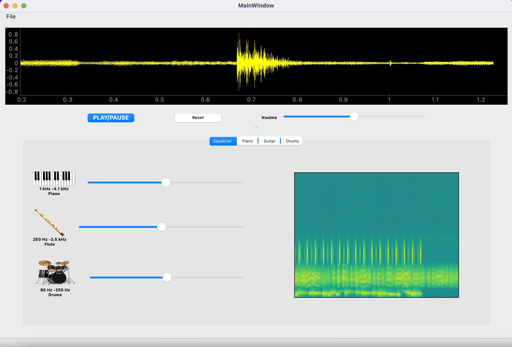
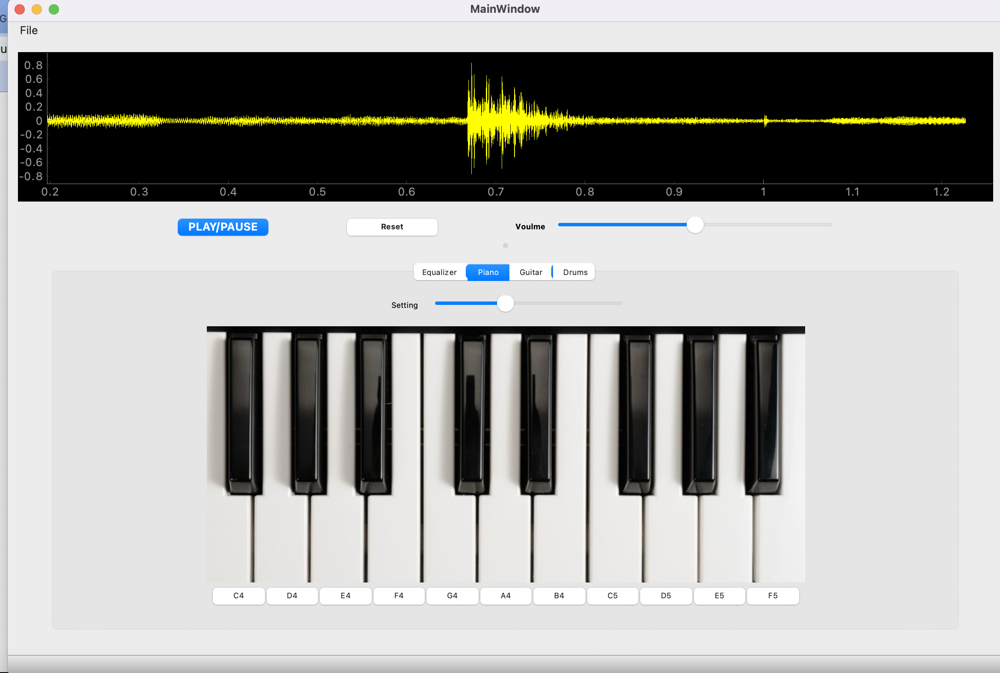
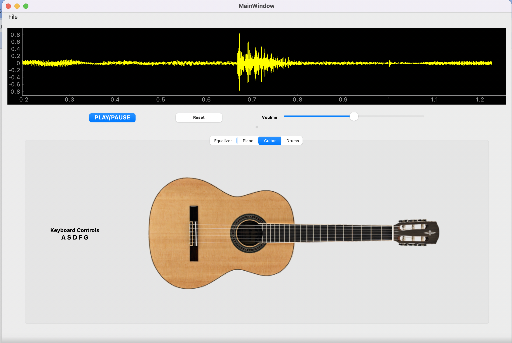
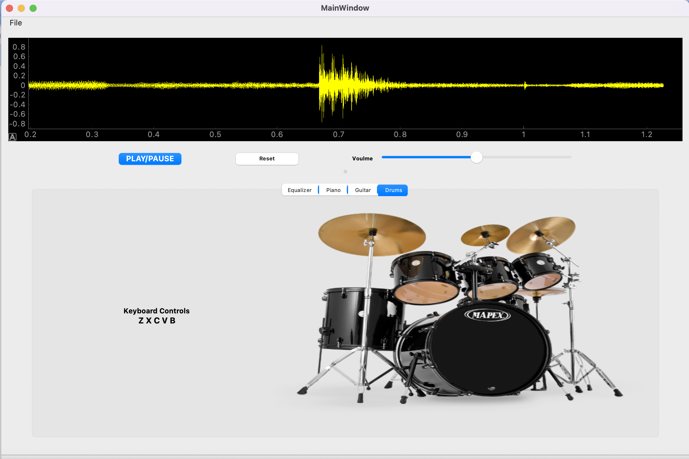

# Equalizer and music emphasizer
## Description

Application for musical instruments emphasizer where:
- The user can open any music file, and play/pause it as a signal (i.e. in a graph) while hearing it.
- The user can control the volume of the music from inside the program.
- The user can see the song histogram while running the signal .
- **signal equalizer where the user can reduce/null/increase the contribution of any of the
instruments in the song or music file.**
- For each instrument, there is a slider that represent the gain of this specific instrument in the output
volume. the user can move it up or down to increase or decrease the weight of this instrument without affecting the other
instruments. This should reflect on the played sound, and the displayed histogram.

- In a separate tab in the application,there is a simulation program of the output of three musical instruments, Piano, drums and guitar.

## Getting Started
there are 2 editions with 2 different UI design.
clone the rebo , install the packages needed then run  V1.py or V2.py

## Screenshots

